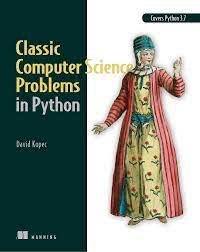
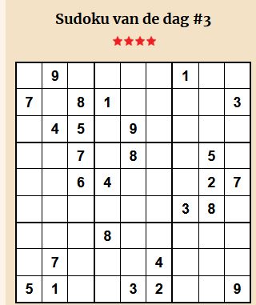
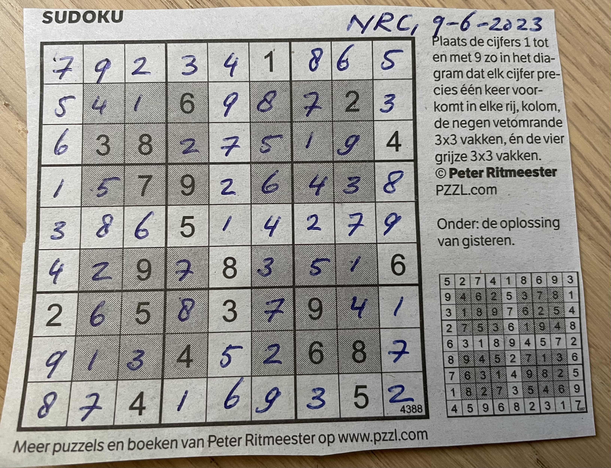

# sudoku-solver

Dit Python programma levert een oplossing voor een (9x9) Sudoku puzzel. In iedere rij, kolom moet ieder cijfer precies één keer voorkomen.
Hiernaast is de puzzel opgebouwd uit 9 'blokken' van iedere 3x3, waarbij in ieder blok ook dezelfde restrictie van toepassing is.

De Sudoku die wordt gepubliceerd in het NRC heeft hiernaast nog een aanvullende restrictie, namelijk dat in de (aansluitende) blokken (rij 2,3,4 of 6,7,8 en kolom 2,3,4 of 6,7,8) óók dezelfde restrictie van toepassing is.

Dit is een puzzel van het type 'Constraint-Satisfaction Problem' en maakt gebruik van het csp-framework dat is beschreven in "[Classic Computer Science Problems in Python](https://www.manning.com/books/classic-computer-science-problems-in-python)" van David Kopec (Manning, 2019). Het hoofdstuk over CSP is verschenen als artikel op de [Manning website](https://freecontent.manning.com/constraint-satisfaction-problems-in-python/), het idee van een programma dat sudoku's kan oplossen is een van de oefeningen.
De oorspronkelijke code voor het csp-framework is afkomstig van David Kopec's GitHub repository [Classic Computer Science Problems in Python](https://github.com/davecom/ClassicComputerScienceProblemsInPython).




## Afhankelijkheden

Dit programma verwacht een standaard Python installatie (getest met Python 3.11) en heeft geen verdere externe afhankelijkheden.

### Formaat invoerbestand

Het invoerbestand moet 9 regels bevatten, waarbij op iedere rij 9 waarden voorkomen die de opgegeven startsituatie weergeven: een cijfer of een spatie (voor een onbekende waarde). Zo wordt de onderstaande sudoku:



weergegeven als:

```
 ,9, , , , ,1, ,
7, ,8,1, , , , ,3
 ,4,5, ,9, , , ,
 , ,7, ,8, , ,5,
 , ,6,4, , , ,2,7
 , , , , , ,3,8,
 , , ,8, , , , ,
 ,7, , , ,4, , ,
5,1, , ,3,2, , ,9

```

## Gebruik

Het programma wordt gestart vanaf de commando prompt met een verplichte bestandsnaam. Hierbij kan (optioneel) worden aangegeven dat er extra restricties van toepassing zijn middels de --mode parameter. Op dit moment wordt alleen de mode 'nrc' ondersteund.

```
python sudoku_solver.py --filename <naam-invoer-bestand> [--mode nrc]
```

### NRC Sudoku
Voorbeeld:


Het oplossen van deze sudoku puzzel kost iets meer tijd dan de reguliere sudoku puzzels, omdat er meer constraints aanwezig zijn. Desalniettemin wordt binnen een seconde de (of in ieder geval een) oplossing gegenereerd:


